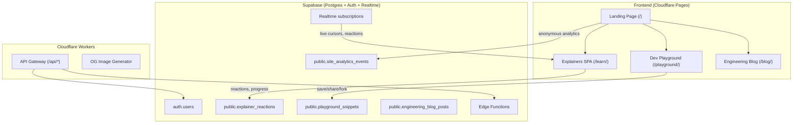

# Engineering Showcase: Making absolutedevs.in a Developer's Jaw-Drop

You already have genuinely impressive frontend engineering — a custom scene-based animation engine, scrub-safe timelines, typed actor DSL, lazy-loaded explainer stories. That alone is rare. This plan adds **backend-powered features** that make developers say *"wait, they built THAT for their site?"* — and makes the architecture scale for real.

## Current State

| Layer | What exists |
|---|---|
| **Landing** | Static HTML at `/` — hero + problem submission form |
| **Explainers** | Vite+React SPA at `/learn/` — 8 interactive explainer stories with a custom engine |
| **Backend** | 1 Cloudflare Pages Function (`/api/thought`) — contact form via Resend + KV rate limiting |
| **Hosting** | Cloudflare Pages with KV bindings |

---

## Proposed Architecture



---

## User Review Required

> [!IMPORTANT]
> **Supabase Free Tier Limits** — Supabase's free plan includes: 500MB database, 1GB file storage, 50K monthly active users, 2M Edge Function invocations, unlimited API requests, real-time support. These are very generous for the features below. However, if any feature doesn't excite you, we can drop it — every feature below is independent.

> [!IMPORTANT]
> **Auth Strategy** — The plan uses **anonymous Supabase auth** (no sign-up friction) for reactions and progress tracking, with optional GitHub OAuth for the playground. This means zero barriers for visitors. Does this approach work for you, or would you prefer something different?

## Open Questions

1. **Playground Language Scope** — The code playground below defaults to a sandboxed TypeScript/JS environment (using a Web Worker + `esbuild-wasm`). Would you also want to support other languages (Python via Pyodide, Rust via WASM), or is JS/TS enough for v1?

2. **Blog Authoring** — Engineering blog posts can be authored as Markdown files in the repo (static, committed) or via a simple admin panel backed by Supabase. Markdown-in-repo is simpler and version-controlled. Preference?

3. **Domain/Subdomain Routing** — The playground and blog can live under paths (`/playground/`, `/blog/`) or subdomains (`play.absolutedevs.in`, `blog.absolutedevs.in`). Paths are simpler. Preference?

---

## Proposed Features (Priority Order)

### Phase 1 — Backend Foundation + "The Wow Factor"

These are the features that make developers stop and inspect your source code.

---

### 1. ⚡ Live Reaction System on Explainers (Supabase Realtime)

**Why it's impressive:** Visitors watching an explainer see *real-time* reaction bubbles from other people viewing the same scene, at the same moment. Not a like button — a **live presence layer**.

**How it works:**
- Supabase Realtime Broadcast channel per explainer slug
- Anonymous Supabase auth (auto-created on first visit, stored in localStorage)
- Reaction types: `🤯 mind-blown`, `💡 aha`, `🔥 fire`, `❓ confused` — mapped to specific scene steps
- Reactions float up from the timeline scrubber with physics-based animation
- A small "X people watching" presence indicator
- Reactions aggregate over time → "This step blew 847 people's minds" shown as a heatmap on the scrubber

**Tables:**
```sql
-- Persisted reaction counts per step (aggregate, not per-user)
create table public.explainer_reactions (
  id bigint generated always as identity primary key,
  story_slug text not null,
  scene_id text not null,
  step_index int not null,
  reaction text not null check (reaction in ('mind-blown','aha','fire','confused')),
  count int not null default 0,
  unique (story_slug, scene_id, step_index, reaction)
);

-- RLS: anyone can read, increment via RPC only
alter table public.explainer_reactions enable row level security;
create policy "Anyone can read reactions" on public.explainer_reactions
  for select using (true);
```

An RPC function handles atomic increment (no double-counting via client-side debounce + anon user ID).

#### Files

##### [NEW] `src/lib/supabase.ts` — Supabase client singleton
##### [NEW] `src/lib/reactions.ts` — Reaction channel hook + broadcast logic
##### [MODIFY] [StoryShell.tsx](file:///c:/Users/Computer/Downloads/absolute-devs-site/explainers/src/engine/StoryShell.tsx) — Wire in reaction overlay + presence count

---

### 2. 🧪 Interactive Code Playground (`/playground/`)

**Why it's impressive:** A full code playground on your portfolio site — with shareable links, forking, and live preview — tells developers you understand tooling at a deep level.

**How it works:**
- Sandboxed TypeScript/JavaScript execution in a Web Worker (using `esbuild-wasm` for transpilation)
- Monaco Editor (VS Code's editor) for syntax highlighting, autocomplete, and inline errors
- Live preview pane (renders HTML/CSS output in a sandboxed iframe, or shows console output)
- **Save & Share**: Snippets saved to Supabase Postgres → generates a short URL (`/playground/s/<nanoid>`)
- **Fork**: Any shared snippet can be forked with one click
- **Starter Templates**: Pre-built examples showcasing algorithms, data structures, system design patterns
- Optional GitHub OAuth to "claim" your snippets

**Tables:**
```sql
create table public.playground_snippets (
  id text primary key default nanoid(),  -- short URL-safe ID
  title text not null default 'Untitled',
  code text not null,
  language text not null default 'typescript',
  author_id uuid references auth.users(id),
  forked_from text references public.playground_snippets(id),
  is_public boolean not null default true,
  created_at timestamptz not null default now(),
  updated_at timestamptz not null default now(),
  run_count int not null default 0,
  -- denormalized metadata
  description text,
  tags text[] default '{}'
);

create index idx_snippets_public on public.playground_snippets(is_public, created_at desc);
create index idx_snippets_author on public.playground_snippets(author_id);

alter table public.playground_snippets enable row level security;
create policy "Public snippets are readable by anyone" on public.playground_snippets
  for select using (is_public = true);
create policy "Authors can manage their snippets" on public.playground_snippets
  for all using (auth.uid() = author_id);
```

**Architecture:**
- New Vite SPA at `/playground/` (separate entry point, same repo)
- esbuild-wasm loaded lazily (~2MB, cached after first load)
- Execution in a Web Worker with a 5-second timeout + memory cap
- Output captured via custom `console` override piped back to main thread

##### [NEW] `playground/` — New Vite sub-app (index.html, src/, vite.config.ts)
##### [NEW] `playground/src/Editor.tsx` — Monaco-based editor component
##### [NEW] `playground/src/Runner.ts` — Web Worker sandbox for safe code execution
##### [NEW] `playground/src/Preview.tsx` — Output/preview pane
##### [NEW] `playground/src/snippets.ts` — Supabase CRUD for snippets

---

### 3. 📊 Transparent Site Analytics (Supabase + Real-time Dashboard)

**Why it's impressive:** Instead of Google Analytics, you build your own privacy-respecting analytics — and expose a **public dashboard** at `/stats/` so anyone can see how the site performs. Radical transparency.

**How it works:**
- Lightweight client-side events: page view, explainer started, explainer completed, playground snippet run, reaction sent
- No cookies, no PII — just event type + timestamp + pathname + anonymous session hash
- Events batched and sent to a Cloudflare Worker → Supabase insert
- Public dashboard at `/stats/` with real-time updating charts (Supabase Realtime on the events table)
- Shows: total visitors, most popular explainers, completion rates, playground usage

**Tables:**
```sql
create table public.site_events (
  id bigint generated always as identity primary key,
  event text not null,
  path text,
  referrer text,
  session_hash text,  -- SHA-256(IP + UA + daily salt), never stored raw
  metadata jsonb default '{}',
  created_at timestamptz not null default now()
);

-- Partition by month for query performance at scale
create index idx_events_created on public.site_events(created_at desc);
create index idx_events_event on public.site_events(event, created_at desc);

alter table public.site_events enable row level security;
create policy "Events are publicly readable" on public.site_events
  for select using (true);
-- Inserts only via server-side (Cloudflare Worker with service_role key)
```

##### [NEW] `src/lib/analytics.ts` — Client-side event tracker (batched, lightweight)
##### [NEW] `functions/api/event.js` — Cloudflare Worker to receive + insert events
##### [NEW] `stats/` — Public analytics dashboard (small standalone page)

---

### Phase 2 — Content & Community

---

### 4. 📝 Engineering Blog (`/blog/`)

**Why it's impressive:** Not a generic blog — each post is an engineering deep-dive with embedded interactive diagrams *powered by the same explainer engine*. A blog post about "How we built the scrub-safe timeline" can embed a live, scrubbable mini-explainer inline.

**How it works:**
- Blog posts authored as MDX files in the repo (version-controlled, PR-reviewed)
- Custom MDX components that embed explainer scenes inline
- Syntax-highlighted code blocks with copy button
- Table of contents auto-generated from headings
- Reading time estimate
- Built as another Vite entry point at `/blog/`

##### [NEW] `blog/` — Blog sub-app (Vite + MDX)
##### [NEW] `blog/posts/` — MDX content directory
##### [NEW] `blog/src/components/` — Blog-specific components (TOC, CodeBlock, EmbeddedScene)

---

### 5. 🔔 Explainer Progress Tracking

**Why it's impressive:** Users can track which explainers they've completed, which steps they paused at — and resume exactly where they left off. Like Netflix for learning.

**How it works:**
- Anonymous Supabase auth (same session as reactions)
- Progress stored per user per explainer: `{ story_slug, last_scene_id, last_step, completed, timestamp }`
- Library page shows completion badges and "Continue" buttons
- No sign-up required — anonymous users get tracked locally; signing in (GitHub OAuth) syncs and persists across devices

**Tables:**
```sql
create table public.explainer_progress (
  user_id uuid references auth.users(id) not null,
  story_slug text not null,
  last_scene_id text not null,
  last_step_index int not null default 0,
  completed boolean not null default false,
  updated_at timestamptz not null default now(),
  primary key (user_id, story_slug)
);

alter table public.explainer_progress enable row level security;
create policy "Users can manage their own progress" on public.explainer_progress
  for all using (auth.uid() = user_id);
```

##### [NEW] `src/lib/progress.ts` — Progress save/load hooks
##### [MODIFY] [Library.tsx](file:///c:/Users/Computer/Downloads/absolute-devs-site/explainers/src/app/Library.tsx) — Show progress badges
##### [MODIFY] [StoryShell.tsx](file:///c:/Users/Computer/Downloads/absolute-devs-site/explainers/src/engine/StoryShell.tsx) — Auto-save progress on step changes

---

### 6. 🖼️ Dynamic OG Image Generation

**Why it's impressive:** Every explainer and playground snippet gets a unique, beautifully rendered Open Graph image — generated on the fly by a Cloudflare Worker using `@cloudflare/pages-plugin-satori` or `satori` + `resvg-wasm`. When someone shares `/learn/dns` on Twitter/Slack, the preview card shows a custom card with the explainer title, a mini version of the motif SVG, and the Absolute Devs branding.

##### [NEW] `functions/api/og.js` — OG image generation worker
##### [MODIFY] [[[path]].js](file:///c:/Users/Computer/Downloads/absolute-devs-site/functions/learn/%5B%5Bpath%5D%5D.js) — Inject dynamic `<meta>` tags per slug

---

## Infrastructure Changes

### Supabase Setup
1. Create a new Supabase project (free tier)
2. Run the SQL migrations above
3. Configure anonymous auth (enabled by default)
4. Optionally enable GitHub OAuth provider
5. Store `SUPABASE_URL` and `SUPABASE_ANON_KEY` as Cloudflare Pages env vars (these are public-safe)
6. Store `SUPABASE_SERVICE_ROLE_KEY` as a secret env var (server-side only, for analytics inserts)

### Repo Structure (After)
```
absolute-devs-site/
├── index.html              # Landing page
├── functions/
│   ├── api/
│   │   ├── thought.js      # Existing contact form
│   │   ├── event.js        # [NEW] Analytics event ingestion
│   │   └── og.js           # [NEW] OG image generation
│   └── learn/
│       └── [[path]].js     # Existing SPA fallback
├── explainers/             # Existing explainer engine
│   └── src/
│       ├── lib/            # [NEW] Shared Supabase utilities
│       │   ├── supabase.ts
│       │   ├── reactions.ts
│       │   ├── progress.ts
│       │   └── analytics.ts
│       └── ...
├── playground/             # [NEW] Code playground SPA
├── blog/                   # [NEW] Engineering blog
├── stats/                  # [NEW] Public analytics dashboard
└── supabase/
    └── migrations/         # [NEW] SQL migration files
```

### Scaling Considerations
- **Database**: Supabase free tier → Pro tier ($25/mo) if traffic grows. Postgres scales well.
- **Edge Functions**: Cloudflare Workers handle API gateway — globally distributed, ~0ms cold start.
- **Static Assets**: Cloudflare Pages CDN — already globally cached.
- **Code Splitting**: Each feature (playground, blog, stats) is a separate Vite entry point → independent bundles.
- **Realtime**: Supabase Realtime uses WebSocket multiplexing — one connection handles reactions + presence + analytics.

---

## Verification Plan

### Automated Tests
- `npm run build` in each sub-app (explainers, playground, blog) — must succeed
- SQL migrations run cleanly on a fresh Supabase project
- Playwright E2E tests for: explainer reaction flow, playground save/share/fork, progress persistence

### Manual Verification
- Share an explainer link on Twitter/Slack → verify OG image renders correctly
- Open the same explainer in two browser tabs → verify real-time reactions appear cross-tab
- Complete an explainer → verify progress badge appears on library page
- Create a playground snippet → share link → open in incognito → verify code loads
- Check `/stats/` dashboard → verify events flow in real-time

---

## Recommended Build Order

| Priority | Feature | Effort | Impact |
|----------|---------|--------|--------|
| 🥇 | Supabase foundation + reactions | 2–3 days | High — the "live" feeling is immediately palpable |
| 🥈 | Progress tracking | 1 day | Medium — piggybacks on Supabase auth from above |
| 🥉 | Code playground | 3–4 days | Very high — this is the "wait, they built THAT?" feature |
| 4 | OG image generation | 1 day | Medium — polish that makes sharing feel premium |
| 5 | Analytics dashboard | 2 days | Medium — radical transparency is a conversation starter |
| 6 | Engineering blog | 2–3 days | Medium — long-term content play |

**Total estimated effort: ~12–14 days for everything, or ~4 days for Phase 1 alone.**
