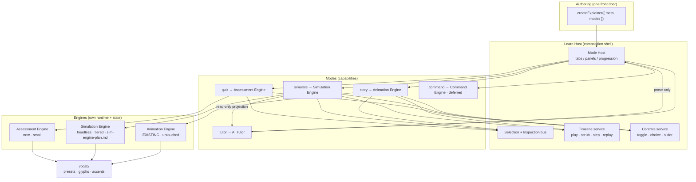

# Interactive Learning Engine — Product Architecture & Roadmap

> **This document evolves, and supersedes the framing of, `sim-engine-plan.md`.**
> It does not throw that work away. The deterministic simulation engine designed
> there is still correct — but it was framed as *the* engine. It is not. It is
> **one module** inside a composable learning platform. This document is the
> umbrella; `sim-engine-plan.md` is now the deep-dive spec for the Simulation
> module only (rescoped to tiers here — see §6 and §11).
>
> If you are resuming: read **§0** then **§10 (V1 scope)** and **§11 (roadmap)**.

---

## 0. Resume Here (state for a new session)

**The correction that reframes everything.** The previous plan optimized for
"the most general engine." That is the wrong objective. A generic engineering
simulator is the wrong abstraction for a platform whose real unit of value is
**an unforgettable explainer**. DNS, Git, Kubernetes and MoE do not want the same
interaction — they want *different* ones, and each explainer wants to *mix
several*. So we are not building one engine. We are building an **ecosystem of
composable interaction modules** that any explainer can assemble like Lego.

**The product goal (the only thing being optimized):**

> Let an author compose an unforgettable explainer from reusable interaction
> capabilities, without writing bespoke runtime logic each time.

```ts
createExplainer({
  meta,
  modes: [ story(...), simulate(...), quiz(...), tutor(...) ],
})
```

**Decisions locked by this document:**

1. The top-level abstraction is **composition, not simulation**. An explainer is
   a container that mounts multiple **modes**, each backed by a capability, all
   sharing one visual vocabulary, one selection/inspection surface, and one
   timeline service. (§3, §4)
2. The existing **animation engine is untouched** and becomes the `story` mode —
   the narrative spine most explainers still open with. (§7)
3. There are **few real engines, and many thin adapters**. Sandbox, Challenge,
   Puzzle, "Packet engine" are **not** engines — they are compositions of the
   real ones. Building them as separate engines would be the over-engineering the
   brief warns against. (§5, §6)
4. The simulation engine is **kept but tiered and simplified**. Most explainers
   need Tier 0/1 (scripted or single-pass), not the full fixpoint solver. The
   solver, marketplace, and server-side verification are **deferred**, not built
   in v1. (§6, §9)
5. Migration is **strictly additive**: existing explainers keep working
   unchanged; they opt into new modes one at a time. (§12)

**V1 ships (see §10):** vocab extraction · the `createExplainer` composition
shell + mode host · the **Assessment (quiz)** engine (cheapest, benefits *every*
explainer) · **Simulation Tier 1** on one existing topic · a thin **AI Tutor** ·
the shared **Timeline** service reused by story + sim.

**Explicitly NOT in v1:** fixpoint solver, Command/REPL engine, scenario
marketplace, versioning, server-side replay / anti-cheat, standalone sandbox
authoring. (§13)

---

## 1. Which interaction capabilities actually emerge from our explainers?

Rather than invent engines, read them off the explainers we already have and the
ones on the roadmap. For each listed interaction, the question is: *is this a new
runtime, or a composition of existing ones?*

| Explainer | Interactions it wants | Backed by |
|---|---|---|
| **DNS** | narrated story · packet flow · inspect a packet · quiz · sandbox | story · **sim (Tier 0/1)** · inspect(shared) · **quiz** · sim-freebuild |
| **Git internals** | commit graph · branch playground · merge-conflict sim · timeline replay · command palette | story/graph-render · **sim** · **sim** · timeline(shared) · **command** |
| **Kubernetes** | cluster sim · scheduling playground · failure injection · timeline · AI explain | **sim** · **sim** · sim-events · timeline(shared) · **tutor** |
| **MoE** | token routing viz · expert activation sim · interactive controls · perf comparison | story · **sim** · controls(shared) · sim-compare |
| **Elasticsearch / Deployment** | topology · shard/replica behavior · failover · cost/latency readout | **sim** |

**What this table proves:**

- A handful of capabilities recur *everywhere*: **narrated animation**,
  **interactive controls**, **inspection**, **timeline/scrub**, **quiz**, and
  **simulate**. Those are the load-bearing ones.
- Almost every "playground / injection / comparison / sandbox" is the **same**
  simulation capability in a different framing (mission vs. free-build vs.
  compare-two-configs). That is a composition, not a new engine.
- **Command palette** (git / kubectl) is genuinely distinct — a text-command →
  state-transition loop — and appears in ≥2 topics, so it earns a small engine,
  but it is not on the v1 critical path.

---

## 2. Which functionality is common across all topics?

The intersection of Kubernetes, DNS, Git, Elasticsearch, Deployment and MoE:

1. **A visual vocabulary** — nodes, servers, DBs, queues, packets, glyphs,
   accents. *Already exists* (`presets.ts`, `glyphs.ts`). → extract to `vocab/`.
2. **Selection + inspection** — hover/click a thing, read a panel about it.
   *Already exists* as `ActorSpec.note`. → promote to a shared service.
3. **Interactive controls** — toggles, choices, sliders that change the scene.
   *Partly exists* (`toggle`/`choice`). → extend, share.
4. **A time axis** — play, pause, scrub, step, replay. *Animation scrubs today.*
   → extract a shared **Timeline** service both story and sim drive.
5. **Checking understanding** — a prompt, an answer, feedback. *Does not exist.*
   → the **Assessment** engine. Highest leverage per line of code.
6. **A narrative frame** — eyebrow, mission, takeaway, "what did we learn."
   *Already exists* in `meta`/scene shells.

These six commons become **shared services + the composition shell**, not
engines. Engines are only for capabilities with their own *runtime and state
model* (§5).

---

## 3. The core idea: an explainer is a composition of modes

An **explainer** = `meta` + an ordered set of **modes**. A **mode** is a named,
mountable panel backed by a capability, e.g. `story`, `simulate`, `quiz`,
`tutor`, `command`. Modes are independent but share three things through the
host:

- **One vocabulary** (`vocab/`) — a Redis is the same violet card in the story,
  the sim, and the quiz diagram.
- **One selection/inspection bus** — click a node in the sim, its inspector is
  the same component the story uses.
- **One timeline** — story keyframes and sim ticks are both positions on a shared
  scrubbable axis.

```ts
// authoring: compose capabilities, don't write runtime logic
export default createExplainer({
  ...meta,
  modes: [
    story({ scenes: [ /* existing animation engine, unchanged */ ] }),
    simulate({ scenario: "dns-resolution", tier: 1 }),
    quiz({ questions: [ /* ... */ ] }),
    tutor({ enabled: true }),
  ],
});
```

This is the Lego principle from the brief made literal. `createExplainer` is the
direct descendant of the existing `E.story({...})` facade — same philosophy
(one autocompleteable front door, no deep imports), widened from "a story" to
"a composition of modes."

**Why composition beats one mega-engine:** each topic activates only the modes it
needs; a mode can be built, tested and shipped independently; and a *little
duplication between modes is acceptable* if it keeps each mode simple and fast to
author. That is the explicit trade the brief asked for.

---

## 4. System architecture



**Read the arrows:** the host orchestrates modes; modes drive engines; engines
share only `vocab/`. The AI tutor reads a projection and returns prose — it never
feeds back into an engine (the determinism guarantee from `sim-engine-plan.md §3`
still holds, now scoped to the sim module).

---

## 5. Engine decomposition — what earns the name "engine", and why

The bar for "engine": **its own runtime loop and state model**. Everything below
the line is a composition or a shared service, and building it as a separate
engine would be over-engineering.

### Real engines (own runtime + state)

| Engine | Justification (from real explainers) | Status |
|---|---|---|
| **Animation** | The narrative spine of every explainer; already excellent. | **Exists — keep untouched.** |
| **Simulation** | K8s cluster, DNS flow, MoE routing, ES shards, Git graph mutation, Deployment topology — all want *computed* state, not scripted keyframes. Recurs in ≥5 topics. | **Keep, tiered & simplified** (§6). |
| **Assessment** | Every topic wants to check understanding; nothing does today; tiny to build; ships value to all explainers at once. | **New — v1.** |
| **Command / REPL** | Git commands and `kubectl` are a text→state loop unlike anything else. Two+ topics. | **New — deferred** (§13). |

### Thin adapters / services (NOT engines)

| Thing | What it really is | Why not an engine |
|---|---|---|
| **AI Tutor** | A read-only projection + an LLM call returning prose. | No runtime, no state — it's an adapter over a model. |
| **Timeline / Replay** | A shared scrub/step/replay service over any mode that has a time axis. | Cross-cutting service, used by story *and* sim. Making it an engine would duplicate what animation already does. |
| **Controls / Inspection** | Shared UI services (sliders, toggles, hover panels). | Pure UI over other modes' state. |
| **Sandbox** | The Simulation engine with **no mission** + a free palette. | It's a *mode config*, not a runtime. |
| **Challenge / Puzzle** | Simulation + a scenario + scoring predicates. | A composition of sim features, not a new loop. |
| **Network / Packet "engine"** | Story animation for scripted packets; a Tier-0 sim state machine when the path is interactive. | Already covered by animation + sim Tier 0. A third packet runtime would duplicate both. |

**This is the answer to "do not create engines without strong justification":**
four engines total, one of which already exists and one of which is deferred.
Everything else the brief listed collapses into two of them plus shared services.

---

## 6. Critical re-evaluation of the previous proposal (Keep / Simplify / Defer / Remove)

The prior `sim-engine-plan.md` is sound engineering but scoped for a standalone
product. Held against "unforgettable explainers, ship fast," each subsystem:

| Subsystem (from sim-engine-plan.md) | Verdict | Why |
|---|---|---|
| **Deterministic kernel** (pure `step`, seeded RNG, headless) | **Keep** | This is the one non-negotiable "product not toy" property. Cheap to hold from day one; expensive to retrofit. |
| **Fixpoint metric solver** (bounded iteration over feedback) | **Simplify → Defer full version** | Introduce **tiers**: **Tier 0** scripted state machine (DNS steps, Git graph ops), **Tier 1** single forward pass (topology → per-node load/latency, no feedback), **Tier 2** bounded fixpoint (cache↔DB feedback). Ship Tier 1. Build Tier 2 only when a scenario provably needs feedback. Most explainers never leave Tier 0/1. |
| **Rule/plugin registry** | **Keep, simplify** | Registry of pure component rules is the extensibility spine (adding Redis = register a rule). But drop *versioned* packs for now. |
| **Metrics engine** (open metric vocabulary) | **Keep, right-size** | Open keyed metrics are good and free. Only add a metric when a scenario emits it. |
| **Event engine** (scheduled + interactive faults) | **Keep, minimal** | Failure injection is a headline feature (K8s, DNS, Deployment). Keep it, but events are just scheduled inputs — no elaborate scheduler. |
| **Timeline / replay** | **Keep, but as a SHARED service** | Not a sim-only module. Extract one Timeline the story mode also uses. Skip delta-compression until a real perf need appears (snapshot-per-tick is fine at this graph size). |
| **Scenario system + scoring** | **Keep for sim, simplify** | Scenarios are how a sim becomes a lesson. Keep scenario data + success predicates. Scoring rubric = simple pass/margin for now. |
| **AI projection layer** | **Keep, as the Tutor adapter** | Read-only projection → prose. Exactly right; just reframed as a mode adapter, not a sim submodule. |
| **Versioned scenario marketplace** | **Defer (Phase 9+)** | Zero v1 value; no community authors yet. The `engineVersion`/`version` fields can exist in the type but aren't enforced. |
| **Server-side replay / anti-cheat (Worker)** | **Remove from v1** | Presupposes competitive leaderboards we haven't shipped. Determinism keeps the door open; don't build the door yet. |
| **Full monorepo migration** | **Defer** | In-repo folders (Path A) ship fastest; React-free discipline keeps the lift to a monorepo a `git mv`. |

Net effect: the sim engine's **v1 surface shrinks to** kernel + Tier-1 solver +
rule registry + minimal events + scenarios, sharing the Timeline and Vocab with
the rest of the platform. That is a few weeks of focused work, not a quarter.

---

## 7. What stays inside the existing animation engine (untouched)

Do **not** redesign it. It keeps everything it does today and becomes the `story`
mode via a one-file adapter:

- Keyframe choreography, scene compilation, camera, actors/channels/registry.
- Narrative shells (`meta`, intro, chapter/takeaway/nextPrompt).
- `toggle`/`choice` re-running `setup()` (its form of interactivity).
- The `E` authoring facade — which `createExplainer` wraps, not replaces.

The only change touching the engine directory is **extracting** `presets.ts` +
`glyphs.ts` into `vocab/` and importing them back (Phase 0, behavior-neutral).

---

## 8. Shared APIs (the contracts every mode agrees on)

Three small contracts are what make modes composable. Keep them tiny.

```ts
// 1) Vocabulary — the shared visual language (extracted from engine/)
//    Both animation actors and sim nodes resolve their look through this.
import { vocab } from "../vocab";           // presets, glyphs, accents

// 2) Selection bus — one inspection surface across modes
interface Selection {
  select(ref: EntityRef): void;             // node/actor/packet/token
  subscribe(cb: (sel: EntityRef | null) => void): () => void;
}
// An EntityRef is { kind, id } — the host maps it to a vocab preset + a `note`.

// 3) Timeline service — one time axis story & sim both drive
interface Timeline {
  play(): void; pause(): void;
  seek(t: number): void;                    // scrub
  step(dir: 1 | -1): void;
  readonly length: number;                  // frames (anim) or ticks (sim)
  subscribe(cb: (t: number) => void): () => void;
}

// 4) Mode contract — what createExplainer mounts
interface Mode {
  id: string;                               // "story" | "simulate" | "quiz" ...
  label: string;
  mount(host: HostServices, container: HTMLElement): void;
  unmount(): void;
}
interface HostServices { vocab: Vocab; selection: Selection; timeline: Timeline; controls: Controls; }
```

Every mode receives the **same** `HostServices`. That is the entire coupling
surface — narrow on purpose. A mode that needs nothing shared (a static quiz)
simply ignores the services it doesn't use.

---

## 9. The Assessment engine (the highest-leverage new build)

It is the cheapest engine and the only one that improves *every* explainer at
once, so it leads v1 alongside sim Tier 1.

- **Data-declared questions**, glob-discoverable like stories/scenarios:
  multiple-choice, predict-the-outcome (answer references a sim end-state),
  order-the-steps, identify-on-diagram (uses the selection bus + vocab).
- **Deterministic feedback**: correct/incorrect + an explanation string; optional
  hand-off to the Tutor for a follow-up.
- **No new visual system** — it renders questions and reuses `vocab` for any
  diagram-based question. That is why it is cheap.

```ts
quiz({
  questions: [
    { type: "mcq", prompt: "Where is a DNS answer cached first?",
      options: ["Root server", "Your resolver", "The registry"], answer: 1,
      explain: "Your recursive resolver caches the answer for the TTL." },
    { type: "predict", prompt: "Add a Redis cache. What happens to DB load?",
      scenario: "reduce-read-latency", metric: "dbLoadPct", answer: "drops" },
  ],
})
```

---

## 10. What Version 1 actually includes

V1 is a **thin vertical slice through the whole architecture**, not one engine
built deep. Success = one existing explainer (recommend **DNS** or **Kubernetes**)
running story + simulate + quiz + tutor from a single `createExplainer` call.

1. **`vocab/` extraction** — presets/glyphs/accents shared by all engines.
2. **`createExplainer` + Mode Host** — the composition shell, tabs/panels,
   shared Selection + Timeline + Controls services.
3. **`story` adapter** — existing animation engine mounted as a mode, unchanged.
4. **Assessment engine** — data-declared quizzes, discovered by glob.
5. **Simulation Tier 1** — headless deterministic kernel + single-pass solver +
   rule registry + minimal events + one scenario on the chosen topic.
6. **AI Tutor (thin)** — `projectForAI` → Claude → prose panel, read-only.
7. **Shared Timeline** — one scrub axis reused by story and sim.

Everything in V1 is independently shippable and independently useful (the quiz
engine helps explainers even before sim lands).

---

## 11. Development roadmap (each phase ships something usable)

| Phase | Deliverable | Ships | Depends on |
|---|---|---|---|
| **0. Vocab extraction** | Move presets/glyphs/accents to `vocab/`; animation engine imports them back. Behavior-neutral. | Refactor PR; all explainers still build (`tsc -b`, `vite build`, verify). | — |
| **1. Composition shell** | `createExplainer` + Mode Host + Selection/Timeline/Controls services; `story` adapter wraps the existing engine. One current explainer runs unchanged *through the shell*. | The Lego front door, backward-compatible. | 0 |
| **2. Assessment engine** | Quiz mode: MCQ + order + identify; glob-discovered; renders via vocab. Add a quiz to one live explainer. | First new interaction on prod. | 1 |
| **3. Sim Tier 0/1 kernel** | Headless deterministic kernel, single-pass solver, rule registry, golden Vitest traces. One topology computes latency/throughput. | Headless package + tests. | 0 |
| **4. `simulate` mode + one scenario** | Mount sim as a mode on the chosen topic (DNS/K8s); build/inspect + live readouts + fault inject; wired to shared Timeline. | First simulate-mode explainer. | 1, 3 |
| **5. AI Tutor** | `projectForAI` + Claude explain/hint panel, read-only; hand-off from quiz. | Tutor panel across modes. | 1, 4 |
| **6. Second topic hardening** | Prove reuse: bring a *second* explainer onto simulate+quiz with near-zero new runtime code. | Reuse validated. | 2, 4 |
| **7. Sim Tier 2 (fixpoint)** | Add bounded feedback solver **only if** a scenario needs cache↔DB feedback (§6). | Feedback scenarios. | 3 |
| **8. Command / REPL engine** | Git/kubectl command→state loop as a mode. | Command mode. | 1 |
| **9. Sandbox + Scenario authoring** | Free-build sim config; author scenarios as data; simple scoring. | Playground surface. | 4, 7 |
| **10. Product hardening** | Versioning, save/share via action log, (optional) Worker replay, telemetry, a11y. | Prod-scale. | as needed |

**Sequencing rationale:** vocab first (unblocks everything); the shell before any
new engine (so modes have a home); the quiz before the sim (fastest value, proves
the mode contract with a trivial engine); the fixpoint solver *last* among sim
work (only if earned). The renderer/UI is intentionally interleaved per-topic
rather than built as one big sandbox up front.

---

## 12. Migration strategy (strictly additive, zero breakage)

1. **Phase 0 is the only edit to existing code**, and it is behavior-neutral
   (imports move; pixels don't).
2. **Existing explainers keep working as-is.** The `story` adapter can wrap a
   current `E.story({...})` with **no change to the story file**. An explainer
   becomes multi-mode by adding entries to `modes: [...]`, never by rewriting.
3. **Opt-in, one explainer at a time.** Add a quiz to DNS this week; add simulate
   to Kubernetes next. No big-bang migration, no frozen main.
4. **The animation engine's public API is frozen for this work.** New capability
   lives in `vocab/`, `learn/` (shell + modes), and `sim/` — never by widening
   the animation engine.

---

## 13. What we explicitly do NOT build yet

- **Full fixpoint solver** — until a scenario needs feedback loops (Phase 7).
- **Command/REPL engine** — justified but not on the v1 critical path (Phase 8).
- **Scenario marketplace + versioning enforcement** — no community authors yet.
- **Server-side replay / anti-cheat / leaderboards** — no competitive scoring yet.
- **Standalone sandbox authoring UI** — sandbox is a sim mode config first.
- **Monorepo split** — in-repo folders until the platform earns its own product
  surface.
- **A separate "packet/network engine"** — covered by animation + sim Tier 0.

Each of these has a clear later home in the roadmap; none blocks an unforgettable
v1.

---

## 14. Folder structure (evolves Path A from sim-engine-plan.md §17)

```
explainers/
  src/
    vocab/              # EXTRACTED shared visual language (presets, glyphs, accents)
                        #   consumed by animation, sim, and assessment
    engine/             # EXISTING animation engine — UNTOUCHED (becomes `story` mode)
    sim/                # Simulation engine (headless, deterministic) — sim-engine-plan.md
      contracts/  kernel/  rules/  metrics/  events/  scenario/  ai/  index.ts
    learn/              # NEW — the Interactive Learning Engine (composition layer)
      createExplainer.ts   # the Lego front door
      host/                # Mode Host: tabs/panels/progression
      services/            # selection, timeline, controls (shared)
      modes/
        story.ts           # adapter → engine/  (no story-file changes)
        simulate.ts        # adapter → sim/
        quiz.ts            # Assessment engine (self-contained)
        tutor.ts           # AI Tutor adapter (projection → Claude → prose)
        command.ts         # DEFERRED
    stories/            # existing explainers (progressively add modes)
    scenarios/          # sim data packs (glob-discovered)
    assessments/        # quiz data packs (glob-discovered)
```

Rule that keeps the eventual monorepo lift cheap: **`sim/` and `vocab/` import no
React**; `learn/` and `engine/` are the React layer. Same discipline as before,
now applied platform-wide.

---

## 15. Trade-offs

- **Several modes vs. one engine:** more surfaces to maintain, but each is small,
  independently testable, and only loaded when a topic needs it. The brief
  explicitly accepts a little duplication for developer velocity — we take it.
- **Tiered sim vs. always-fixpoint:** Tier 1 is "wrong" for feedback-heavy
  systems, but it is right for the majority and ships an order of magnitude
  faster. Tier 2 is there when earned. Documented, not hidden.
- **Shared services vs. mode isolation:** sharing Timeline/Selection/Vocab risks
  coupling; we cap the coupling at the four small contracts in §8 and let modes
  ignore what they don't use.
- **Composition shell as new surface area:** `createExplainer` is new code every
  explainer depends on. Mitigated by making it a thin descendant of the proven
  `E` facade and keeping engines behind it swappable.
- **Two engines forever (animation + sim):** deliberate. They share only `vocab/`.
  Do not attempt to unify them — that was the original over-reach.

---

## 16. How this answers the brief's questions

1. **Engines that emerge:** animation (exists), simulation (tiered), assessment,
   command (later) — plus shared services. (§1, §5)
2. **Common across topics:** vocabulary, inspection, controls, timeline, quiz,
   narrative frame → shared services + shell, not engines. (§2)
3. **Stays in animation engine:** all narrative/keyframe/camera behavior;
   untouched. (§7)
4. **Deserves its own engine:** only capabilities with their own runtime+state —
   simulation, assessment, (later) command. (§5)
5. **Built incrementally without delaying explainers:** additive migration; each
   phase ships; quiz-on-one-explainer this week. (§11, §12)
6. **V1:** vocab + shell + quiz + sim Tier 1 + tutor + shared timeline on one
   topic. (§10)
7. **Not yet:** fixpoint solver, command engine, marketplace, versioning,
   server-side replay, standalone sandbox. (§13)
```
