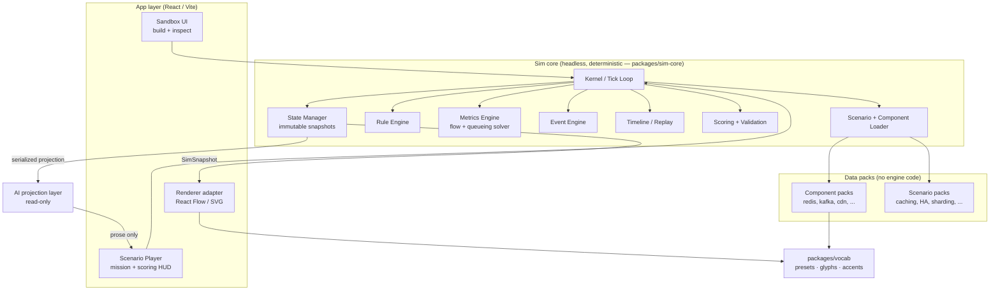
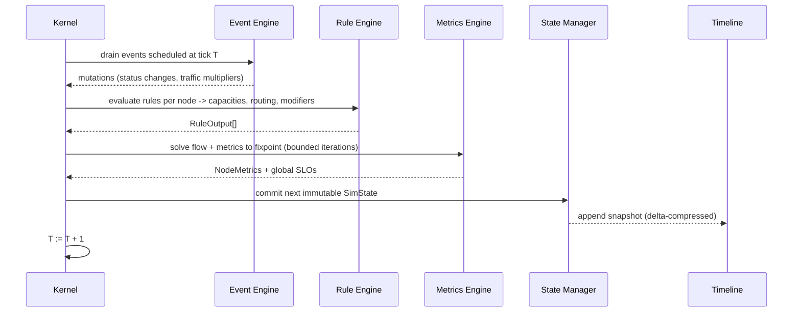

# Engineering Simulation Engine — Architecture & Build Plan

> **Status: DESIGN COMPLETE, IMPLEMENTATION NOT STARTED.**
> This document is the technical design for a new, deterministic **Engineering
> Simulation Engine** that will power interactive "build-and-break" explainers
> on absolutedevs.in. It is written to be handed to an engineer (or a fresh
> Claude session) to begin implementation. If you are resuming: read
> **§0 Resume Here** first, then jump to the phase you are on in **§19 Roadmap**.

---

## 0. Resume Here (state for a new session)

**What this is.** A design for a *second* engine that lives beside the existing
scene-animation engine, not a replacement for it.

- **Existing engine** (`explainers/src/engine`): time-sampled animation. Author
  choreographs keyframes; renderer samples by time. Keep it — it powers narrated
  explainers. It does **not** simulate anything.
- **New engine (this doc)**: a headless, deterministic simulation kernel. The
  user builds an architecture graph, injects events, and the engine *computes*
  metrics from composable rules. AI only explains; it never computes.

**Decisions already locked (do not re-litigate):**

1. The sim core is **headless and framework-free** (pure TS, no React) so it runs
   identically in the browser, in Vitest, and in a Cloudflare Worker. See §3.
2. Determinism is a **hard contract**: same `(scenario, seed, action log)` →
   byte-identical state trace. Seeded RNG only; no `Date.now()`/`Math.random()`
   in the kernel. See §3.
3. The **visual vocabulary is extracted into a shared package** (`packages/vocab`)
   that *both* engines consume, instead of being duplicated. This is the concrete
   "product not toy" move and it is grounded in real code
   (`explainers/src/engine/presets.ts`, `glyphs.ts`). See §2, §17.
4. Metric propagation is a **bounded fixpoint solve over a flow graph per tick**,
   using queueing approximations — not ad-hoc per-scenario math. See §7, §9.
5. Rules are **pure functions registered in a plugin registry**, declared as data.
   No scenario ships custom engine code. See §8, §16.

**What is NOT yet decided (see §21 — needs the user):** renderer choice for v1
(React Flow vs. the existing SVG stage), whether server-side scoring/leaderboards
are in scope for v1, and the monorepo migration appetite.

**Next action when implementation starts:** Phase 1 in §19 — stand up
`packages/sim-core` with the state model, tick loop, and a two-node
(`Client → API`) scenario that produces latency/throughput, behind Vitest golden
tests. No renderer, no rules DSL yet.

---

## 1. Framing: how this refines the original brief

The original brief assumed a greenfield engine. Held against the real codebase,
three claims need correcting:

| Brief assumed | Reality | Consequence |
|---|---|---|
| We are building "the" engine from scratch | A deterministic *animation* engine already exists and is good | Build the sim engine as a **peer**, reuse the vocabulary/renderer split, don't rewrite the animation engine. |
| Nodes/edges/presets must be invented | A production visual vocabulary already exists (`v.users`, `v.database`, `v.cache`, `v.loadBalancer`, glyphs, accents) | The sim's component palette **is** that vocabulary, extracted to a shared package. A Redis is the same violet cache card in both engines. |
| "Metrics update after every change" (hand-wavy) | You cannot fake this at product scale | Metrics must come from a real, if simplified, **flow + queueing model** solved deterministically each tick (§7). Otherwise numbers won't be internally consistent and learners will catch it. |

Everything else in the brief (data-driven, plugin components, deterministic,
timeline replay, AI-explains-only, phased roadmap) is correct and is honored below.

---

## 2. What we reuse vs. what is new

**Reuse (already exists, extract or wrap — do not reinvent):**

- **Visual vocabulary** — `presets.ts` (`v.*`), `glyphs.ts` (glyphs + accents).
  Becomes `packages/vocab`. Each sim component *kind* maps to a vocab preset, so
  the sim inherits a consistent, accessible look for free.
- **Actor/renderer split** — the existing engine already separates "state the
  engine emits" from "how a renderer draws it" (`ActorSpec` + channels +
  registry in `actors.ts`/`registry.ts`). The sim engine copies this contract
  (§15): the kernel emits a `SimSnapshot`; renderers interpret it.
- **The `note` hover-inspector pattern** (`ActorSpec.note`) → node inspection
  panels in the sim.
- **Data-driven discovery** — stories are discovered by `import.meta.glob` with
  zero engine edits. Sim **scenarios** and **component packs** use the same
  pattern (§16).
- **`defineX` authoring facade** (`E` in `api.ts`) — the sim gets an analogous
  `Sim.defineComponent` / `Sim.defineScenario` front door.

**New (no equivalent exists — this is the actual build):**

- The **simulation kernel**: graph state + fixed-timestep tick loop + event queue
  + metric fixpoint solver (§7).
- **Rule engine**: composable, data-declared component behaviors (§8).
- **Metrics engine**: flow propagation + queueing latency/throughput/failure (§9).
- **Event engine**: deterministic fault/traffic injection (§10).
- **Causal timeline**: per-tick snapshots for scrub/replay (§11) — distinct from
  the existing *animation* timeline.
- **Scenario / mission / scoring / validation** (§12–13).
- **AI projection layer**: read-only serialized view for an LLM (§14).

> The existing `explainers/src/engine/timeline.ts` and `validate.ts` are
> *animation-domain* modules. The sim engine's timeline/validation are different
> concepts with the same names; keep them in separate packages to avoid confusion.

---

## 3. Core principle & the determinism contract

**The engine never depends on AI.** AI receives a projection of state and returns
prose (explanations, hints, scenario drafts). It is architecturally downstream of
the kernel and cannot influence a metric. See §14.

**Determinism contract (enforced, not aspirational):**

- The kernel is a pure reducer: `step(state, tickInput) → state'`. Given a
  `Scenario`, a `seed`, and an ordered `ActionLog` (user edits + injected events
  with tick stamps), the full state trace is reproducible bit-for-bit.
- **No ambient nondeterminism in the kernel**: no `Date.now`, no
  `Math.random`, no floating-point-order surprises across engines. A seeded PRNG
  (e.g. a small xorshift/PCG) is threaded through `SimContext`. Wall-clock and
  randomness are *inputs*, never ambient reads.
- **Headless**: `packages/sim-core` imports nothing from React/DOM. This is what
  lets the same trace be computed in a Worker (for server-side scoring/anti-cheat)
  and asserted in golden tests.
- **Serializable everywhere**: state, scenario, and action log are plain JSON.
  This is the precondition for save/share/fork/replay/leaderboards (§18).

This contract is the single most important "product not toy" property. Write the
golden-trace test harness in Phase 1, before any rules exist.

---

## 4. System architecture



**Read the arrows carefully:** everything flows *out* of the kernel into
renderer and AI. Nothing flows *back in* from AI. Data packs feed the loader;
they never call the kernel.

---

## 5. Core engine modules & responsibilities

Each is a module inside `packages/sim-core` with a single responsibility and a
narrow interface (SOLID: they depend on interfaces in `sim-core/contracts`, not
each other's internals).

| Module | Responsibility | Explicitly NOT responsible for |
|---|---|---|
| **Kernel / Tick Loop** | Advances the sim by fixed timesteps; orchestrates the per-tick pipeline (drain events → apply rules → solve metrics → snapshot). Pure reducer. | Rendering, wall-clock timing, AI. |
| **State Manager** | Owns the immutable `SimState`; produces the next state via structural sharing; hands out read-only `SimSnapshot`s. | Deciding *what* changes (that's rules/metrics). |
| **Rule Engine** | Resolves each component's registered behavior into metric *contributions* and routing effects. Composes rules deterministically. | Hardcoding any scenario; it only runs registered pure rules. |
| **Metrics Engine** | Propagates traffic across the graph and solves node metrics (latency, utilization, throughput, drop) to a bounded fixpoint. | Knowing what a "Redis" is — it only sees capacities/costs supplied by rules. |
| **Event Engine** | Holds the scheduled/queued events (traffic spike, node crash, region outage…); applies them at their tick deterministically. | Random timing (timing is seeded/scheduled input). |
| **Scenario Loader** | Instantiates a `Scenario` into an initial `SimState`; resolves component/rule references from the registry; validates versions. | Running the sim. |
| **Timeline Engine** | Records a snapshot per tick (or per keyframe with delta compression); supports scrub/replay/step. | Animating — it stores state; the renderer animates between snapshots. |
| **Validation Engine** | Checks a graph is well-formed (no dangling edges, required deps present, budget/topology constraints) and evaluates mission success predicates. | Scoring weight/policy (that's Scoring). |
| **Scoring Engine** | Turns final/steady-state metrics + constraints into a score/grade against a scenario rubric. | Deciding pass/fail structure (that's mission predicates in Validation). |
| **Renderer Interface** | A published contract (`SimSnapshot` + component→visual mapping) that any renderer implements. | Any drawing itself (lives in app layer). |
| **AI Projection** | Serializes a stable, minimized view of state/metrics/events/timeline/actions for an LLM. | Computing or mutating anything. |

---

## 6. Internal data model

All types are plain, serializable TS. This is the contract surface
(`packages/sim-core/src/contracts`).

```ts
// ---- Graph ----
type NodeId = string & { readonly _brand: "NodeId" };
type EdgeId = string & { readonly _brand: "EdgeId" };

interface SimNode {
  id: NodeId;
  kind: string;              // registry key: "redis" | "postgres" | "nginx" ...
  label?: string;            // author/user override; defaults from component def
  config: Record<string, JsonValue>;   // instance params (e.g. replicas, memoryMB)
  status: "healthy" | "degraded" | "down";
  pos?: { x: number; y: number };       // renderer hint only; kernel ignores it
}

interface SimEdge {
  id: EdgeId;
  from: NodeId;
  to: NodeId;
  kind?: string;             // "http" | "tcp" | "replication" | "async" ...
}

// ---- Metrics (open vocabulary; a metric is just a keyed number + unit) ----
type MetricKey =
  | "latencyMs" | "throughputRps" | "cpuPct" | "memPct" | "bandwidthMbps"
  | "dbLoadPct" | "cacheHitRatio" | "queueDepth" | "availabilityPct"
  | "costPerMonthUsd" | "reliabilityPct" | "errorRatePct";

interface MetricSample { key: MetricKey; value: number; }
type NodeMetrics = Partial<Record<MetricKey, number>>;

// ---- Events ----
interface SimEvent {
  id: string;
  atTick: number;            // deterministic schedule
  type: string;              // "traffic-spike" | "node-crash" | "region-outage" ...
  target?: NodeId | "region:us-east" | "global";
  payload?: Record<string, JsonValue>;   // e.g. { multiplier: 5, durationTicks: 30 }
}

// ---- Rules: pure, registered, composable ----
interface RuleContext {
  node: SimNode;
  inbound: FlowSample[];     // traffic arriving from upstream edges
  neighbors: ReadonlyMap<NodeId, SimNode>;
  rng: SeededRng;            // deterministic; the ONLY randomness source
  tick: number;
}
interface RuleOutput {
  // what this node does to traffic and to metrics THIS tick
  capacityRps?: number;      // how much it can serve
  serviceCostMs?: number;    // base processing latency at zero load
  forwards?: { to: NodeId; fraction: number }[]; // routing (LB, cache-miss, ...)
  metrics?: NodeMetrics;     // direct contributions (cost, memory, hit ratio ...)
  modifiers?: MetricModifier[];  // effects on OTHER nodes (e.g. "cache reduces dbLoad")
}
type Rule = (ctx: RuleContext) => RuleOutput;

// ---- Component definition (data + a rule reference) ----
interface ComponentDef {
  kind: string;              // "redis"
  vocab: string;             // preset key in packages/vocab -> visual identity
  defaults: Record<string, JsonValue>;
  ruleKey: string;           // registered Rule id
  ports?: { in?: string[]; out?: string[] };  // connection typing
  docs?: { note: string; deepDive?: string };
  version: string;           // semver — packs are versioned (§18)
}

// ---- Scenario ----
interface Scenario {
  slug: string;
  title: string;
  difficulty: "beginner" | "intermediate" | "advanced" | "expert";
  brief: { mission: string; narrative?: string };
  initialGraph: { nodes: SimNode[]; edges: SimEdge[] };
  events: SimEvent[];                 // scripted timeline of injections
  constraints: {                      // budget/SLO the learner must satisfy
    budgetUsd?: number; targetUptimePct?: number; maxLatencyMs?: number;
  };
  success: MissionPredicate[];        // evaluated by Validation
  palette: string[];                  // component kinds the learner may add
  seed: number;
  engineVersion: string;              // compat gate (§18)
}

// ---- Simulation state (immutable snapshot) ----
interface SimState {
  tick: number;
  nodes: ReadonlyMap<NodeId, SimNode>;
  edges: ReadonlyMap<EdgeId, SimEdge>;
  metrics: ReadonlyMap<NodeId, NodeMetrics>;
  global: NodeMetrics;                // aggregate SLOs (uptime, total cost ...)
  activeEvents: SimEvent[];
  log: TimelineEntry[];               // causal, human-readable ("10:03 db crashed")
}
```

**Why this shape scales:** metrics are an *open* keyed vocabulary, so adding
`replicationLagMs` later touches no core code. Rules emit *contributions and
modifiers*, so composition ("Redis reduces DB load" + "LB removes SPOF") is
additive, never a special case. Everything is a `Map` of plain records → trivially
serializable for save/replay/AI.

---

## 7. The simulation kernel (the hard part, made concrete)

This is where the brief was vaguest and where a toy would fake it. The kernel
runs a **fixed-timestep loop**; each tick is a deterministic pipeline:



**Metric solve (the core algorithm).** Traffic is a flow from source nodes
(Clients) through the graph. Because caches/queues/replicas create feedback
(a cache miss adds load to the DB; a saturated node sheds load), a single forward
pass is not enough. So each tick:

1. Seed inbound traffic at source nodes from the current request rate (scaled by
   active traffic events).
2. **Iterate to a fixpoint** (cap at, say, 8 iterations): each pass, every node's
   rule computes how much of its inbound it serves vs. forwards vs. drops, given
   the capacity and routing from `RuleOutput`. Downstream load is recomputed.
   Stop when per-node load deltas fall below ε or the cap is hit (guarantees
   termination → determinism).
3. From converged per-node load, derive metrics with **standard queueing
   approximations** — utilization `ρ = load / capacity`; latency rises
   nonlinearly as `ρ → 1` (an M/M/1-style `service / (1 − ρ)` clamp); throughput
   is `min(load, capacity)`; the overflow is drop/error rate. These are
   *approximations chosen for legibility*, not a discrete-event network sim — the
   goal is teaching-true behavior (add a cache → DB load drops → tail latency
   falls), not packet-accurate results.
4. Aggregate global SLOs (availability = healthy weighted capacity / demanded;
   cost = Σ node cost; reliability from redundancy/SPOF analysis).

**Why fixpoint + queueing, not event-stepped packets:** it's deterministic,
cheap (a few passes over a small graph), explainable to a learner, and it
naturally produces the emergent lessons the product exists to teach. A full
discrete-event simulator would be more "accurate" but slower, harder to make
deterministic across platforms, and pedagogically noisier. Documented trade-off.

**Tick vs. wall-clock:** the loop is decoupled from real time. The renderer
requests "advance to tick N" or plays at a chosen ticks/second; the kernel never
sleeps. This is what makes replay and headless test execution identical.

---

## 8. Rule engine

A rule is a **pure function** `(RuleContext) → RuleOutput`, registered by key.
Component defs reference a rule by key; scenarios reference components by kind.
No scenario contains logic.

Composability comes from three additive channels in `RuleOutput`:

- **Local service**: `capacityRps`, `serviceCostMs` — what this node itself does.
- **Routing**: `forwards[]` — how it splits traffic (LB round-robins; a cache
  forwards only misses; a shard forwards by key range).
- **Cross-node modifiers**: `modifiers[]` — declarative effects on *other* nodes'
  metrics, e.g. a cache emits `{ target: db, key: "dbLoadPct", op: "mul", value: 1 − hitRatio }`.
  The metrics engine folds all modifiers targeting a node before solving it, so
  order-independence (and thus determinism) is preserved.

Illustrative (not final) registrations:

```ts
registerRule("cache.readThrough", (ctx) => {
  const hit = clamp(ctx.node.config.hitRatio ?? 0.8, 0, 1);
  const inbound = sum(ctx.inbound.map(f => f.rps));
  return {
    capacityRps: ctx.node.config.capacityRps ?? 50_000,
    serviceCostMs: 1,
    forwards: [{ to: downstreamDb(ctx), fraction: 1 - hit }], // misses only
    metrics: { cacheHitRatio: hit, memPct: memFromKeyspace(ctx) },
  };
});

registerRule("loadBalancer.roundRobin", (ctx) => ({
  serviceCostMs: 0.2,
  forwards: healthyBackends(ctx).map(b => ({ to: b.id, fraction: 1 / n })),
  modifiers: [{ scope: "topology", effect: "removesSPOF" }],
}));
```

**SOLID payoff:** to change how Redis behaves, edit its rule; nothing else moves.
To add a component, register a rule + a component def (§16). The kernel is closed
for modification, open for extension.

---

## 9. Metrics engine

Owns the fixpoint solve (§7) and the metric vocabulary. Key properties:

- **Pull-based, memoized per tick**: node metrics are derived from converged flow,
  cached in the snapshot; renderers/AI read, never recompute.
- **Open metric set**: adding a metric = adding a `MetricKey` + having some rule
  emit it. Aggregation for global SLOs is table-driven (each metric declares how
  it rolls up: sum for cost, weighted-min for availability, etc.).
- **Explainability hooks**: the solver records *why* a metric moved (which node
  saturated, which modifier applied) into the causal `log`, so both the timeline
  and the AI layer can narrate "latency rose because the DB hit 100% at tick 42."

---

## 10. Event engine

Events are scheduled input, applied at their `atTick`, so they're part of the
deterministic trace. Two sources:

- **Scripted** (scenario `events[]`): the authored timeline of a mission.
- **Interactive** (user "inject fault" / "traffic ×5"): appended to the action
  log with the current tick, so a replay reproduces them exactly.

Event handlers are also registered pure transforms
`(SimState, SimEvent) → mutations` (crash sets `status: down` + zeroes capacity;
region outage flips all nodes tagged with that region; traffic spike scales
source rate for `durationTicks`). New event types register without touching the
kernel.

---

## 11. Timeline / replay

Every tick emits a snapshot; the timeline stores them **delta-compressed**
(only changed nodes/metrics) plus periodic keyframes so scrubbing to tick N is
O(keyframe + deltas). The causal `log` gives the human-readable track
("10:00 traffic ↑ · 10:02 CPU 90% · 10:03 DB crash · 10:04 recovery").

Replay = re-run `step()` from tick 0 over the action log (authoritative, used for
scoring/anti-cheat in a Worker) **or** scrub the stored snapshots (cheap, used by
the UI). Both agree because the kernel is pure.

> This is a different module from `explainers/src/engine/timeline.ts`, which
> compiles *animation* keyframes. Do not merge them.

---

## 12. Scenario system & progressive difficulty

A `Scenario` (§6) is pure data discovered by glob from a scenario pack — adding
one touches no engine code, mirroring how explainer stories are discovered today.

Difficulty is **data, not code**: `difficulty` gates palette size, budget
tightness, event severity, and how many success predicates must hold. A
"beginner caching" and an "expert multi-region HA" scenario run on the identical
kernel; only their JSON differs. Example (abridged):

```ts
Sim.defineScenario({
  slug: "reduce-read-latency",
  difficulty: "beginner",
  brief: { mission: "Get p95 read latency under 100ms without exceeding $50/mo." },
  initialGraph: { nodes: [client, express, postgres], edges: [/* ... */] },
  constraints: { budgetUsd: 50, maxLatencyMs: 100, targetUptimePct: 99.9 },
  events: [{ id: "e1", atTick: 20, type: "traffic-spike", payload: { multiplier: 4 } }],
  success: [{ metric: "latencyMs", scope: "global", op: "<", value: 100 }],
  palette: ["redis", "cdn", "read-replica"],
  seed: 1234,
  engineVersion: "1.x",
});
```

---

## 13. Scoring & validation

- **Validation** = structural + mission predicates. Structural: no dangling
  edges, port-type compatibility, required dependencies, budget not exceeded.
  Mission: the `success[]` predicates over steady-state/final metrics.
- **Scoring** = a scenario rubric turning metrics + slack (budget headroom, SLO
  margin, redundancy) into a grade. Deterministic, so a Worker can recompute a
  submitted action log to verify a leaderboard entry (anti-cheat).

---

## 14. AI integration layer

A pure projection: `projectForAI(SimState, ActionLog) → AIContext` (stable,
minimized JSON): current graph, current + recent metrics, active/recent events,
the causal timeline, and the learner's actions. The LLM returns **prose only** —
explanation, hint, architecture review, or a *draft* `Scenario` (which then goes
through the normal loader/validator like any other data). The kernel has no
import of the AI layer; the dependency points one way (see §4 arrows).

Use the latest Claude models for this layer (per repo convention); the projection
is provider-agnostic JSON so the model can change without engine impact.

---

## 15. Renderer interface

The kernel emits `SimSnapshot` (immutable view of `SimState` + a component→visual
resolution via `packages/vocab`). A renderer is any module implementing:

```ts
interface SimRenderer {
  mount(container: unknown, opts: RendererOpts): void;
  render(snapshot: SimSnapshot): void;   // called per tick / per scrub frame
  onUserEdit(cb: (edit: GraphEdit) => void): void;   // add/remove/connect nodes
  onInject(cb: (event: SimEvent) => void): void;
  unmount(): void;
}
```

This mirrors the existing engine's actor/renderer split, so React Flow, a raw
SVG/Canvas stage, or a future 3D view are swappable without kernel changes.
`GraphEdit`/`SimEvent` from the renderer go into the action log → kernel; the
renderer never mutates state directly.

---

## 16. Extensibility walkthrough — adding RabbitMQ

No engine internals are touched:

1. **Register a rule** (`rules/messaging/rabbitmq.ts`):
   `registerRule("rabbitmq.broker", ctx => ({ capacityRps, serviceCostMs, metrics: { queueDepth }, forwards: toConsumers(ctx) }))`.
2. **Define the component** (`components/messaging/rabbitmq.ts`):
   `Sim.defineComponent({ kind: "rabbitmq", vocab: "queue", ruleKey: "rabbitmq.broker", defaults: {...}, ports: { in: ["async"], out: ["async"] }, version: "1.0.0" })`.
3. Add `vocab: "queue"` already exists in `packages/vocab` (the amber queue
   preset); if a truly new visual is needed, add one preset there.
4. The component pack is glob-discovered; `rabbitmq` now appears in any scenario
   whose `palette` lists it. **Zero kernel edits.**

Same three-step recipe for Cloudflare/CDN, a new database engine, etc.

---

## 17. Folder structure (grounded in the real repo)

The repo today is a static site + the `explainers/` Vite app. Two viable paths:

**Path A — light (recommended for v1):** keep it in-repo under `explainers/`,
introduce package boundaries as folders now, promote to a real monorepo later.

```
explainers/
  src/
    engine/           # EXISTING animation engine — untouched
    sim/              # NEW sim engine (headless core; no React imports)
      contracts/      # types from §6, the stable interface surface
      kernel/         # tick loop, state manager
      rules/          # rule engine + built-in rule registry
      metrics/        # flow + queueing solver, rollups
      events/         # event registry + handlers
      timeline/       # snapshot store, replay
      scenario/       # loader, validation, scoring
      ai/             # projectForAI (pure)
      index.ts        # Sim facade: defineComponent/defineScenario/createSim
    vocab/            # EXTRACTED shared vocabulary (presets, glyphs, accents)
                      #   -> engine/ and sim/ both import from here
    components/       # data packs: redis.ts, kafka.ts, ... (glob-discovered)
    scenarios/        # data packs: caching.ts, ha.ts, ... (glob-discovered)
    renderers/
      reactflow/      # SimRenderer impl
    app/              # Sandbox + Scenario Player UI
```

**Path B — full monorepo (when the sim becomes its own product):** pnpm/turbo
workspaces:

```
packages/
  vocab/       sim-core/   sim-rules/   sim-renderer-reactflow/
apps/
  learn/       # existing explainers app (consumes vocab + both engines)
  sim/         # standalone simulator, if it graduates to its own surface
data/
  components/  scenarios/
```

**Recommendation:** start **Path A** (no build-system churn, ships fastest),
with `sim/` strictly not importing React so the eventual lift to Path B is a
`git mv`, not a rewrite. Extracting `vocab/` from `engine/` is the one real
refactor to do up front (§19 Phase 0) because both engines will depend on it.

---

## 18. Persistence, serialization & versioning (product-scale)

- **Save/share/fork**: persist `{ scenarioSlug, seed, actionLog }`, not raw state
  — it's tiny and replays to identical state. Snapshots are a cache, not the
  source of truth.
- **Versioning**: `Scenario.engineVersion` and `ComponentDef.version` are semver.
  The loader refuses/adapts incompatible packs. This is what lets a "scenario
  marketplace" exist without every old scenario breaking on an engine bump.
- **Server-side authority (optional, §21)**: because the kernel is headless and
  deterministic, a Cloudflare Worker can re-run a submitted `actionLog` to verify
  scores/leaderboards — the same code path as the browser. This dovetails with
  the existing Cloudflare Pages Functions + KV setup and the Supabase plan in
  `implementation_plan.md`.

---

## 19. Roadmap (each phase independently shippable)

| Phase | Deliverable | Ships | Gate to next |
|---|---|---|---|
| **0. Vocab extraction** | Move presets/glyphs/accents to `sim/vocab` (Path A); both engines import it. No behavior change. | Refactor PR, all existing explainers still build (`tsc -b` + `vite build` + `explainers:verify`). | Green build + visual parity. |
| **1. Minimal kernel** | `contracts/` + state manager + fixed-timestep loop + fixpoint solver; one hardcoded `Client → API → DB` graph produces latency/throughput. **Golden-trace Vitest harness.** No rules DSL, no renderer. | Headless package + tests. | Deterministic trace asserted; two identical runs match byte-for-byte. |
| **2. Rule engine** | Rule registry; extract the Phase-1 math into `redis`/`postgres`/`nginx`/`lb` rules; composition (cache reduces DB load) works. | Component packs for ~6 core kinds. | Adding a cache measurably drops DB load & tail latency in a test. |
| **3. Scenario system** | Loader + validation + one real scenario ("reduce read latency") end-to-end, headless (assert mission predicate passes when a cache is added). | Scenario pack + player logic (no UI yet). | Mission pass/fail computed from a scripted action log. |
| **4. Event engine** | Scheduled + interactive events (traffic spike, node crash, region outage); durations; recovery. | Event pack. | A crash → metric degradation → recovery visible in the trace. |
| **5. Timeline/replay** | Snapshot store, delta compression, scrub-to-tick, causal log. | Replay API. | Scrubbed state == replayed state at every tick. |
| **6. Renderer + Sandbox UI** | React Flow adapter implementing `SimRenderer`; build/connect/inspect; live metric readouts; inject-fault controls. | First user-visible sandbox at `/learn` (or `/sim`). | A learner can build the caching scenario and watch latency fall. |
| **7. AI explanations** | `projectForAI` + an explain/hint endpoint (Claude) wired into the player. | AI panel. | Hidden-metric prompt injection impossible (AI reads projection only). |
| **8. Scoring + Sandbox mode** | Rubric scoring, free-build sandbox, save/share via action log. | Persistence. | Deterministic score reproduces from action log. |
| **9. Scenario marketplace** | Versioned packs, user-authored scenarios via loader/validator, browse UI. | Marketplace surface. | A community pack loads & version-gates correctly. |
| **10. Production hardening** | Worker-side authoritative replay/anti-cheat, perf budget on the solver, telemetry, a11y pass. | Prod. | p95 tick solve within budget; leaderboard verified server-side. |

**Sequencing rationale:** the determinism harness (Phase 1) precedes rules so
every later phase is guarded by golden tests; the renderer is deliberately late
(Phase 6) because the kernel must be proven headless first, or the two get
entangled and the "product not toy" property is lost.

---

## 20. Trade-offs & risks

- **Queueing approximation vs. discrete-event accuracy** (§7): chosen for
  determinism, speed, and legibility. Risk: an expert learner notices it's not
  packet-accurate. Mitigation: be explicit in-copy that it's a *teaching model*;
  the emergent behaviors (saturation, tail latency, SPOF) are directionally true.
- **Fixpoint convergence**: feedback loops (cache↔DB, retries) could oscillate.
  Mitigation: hard iteration cap + ε threshold → guaranteed termination, and
  damping on load updates. Covered by golden tests.
- **Two engines to maintain**: animation + sim. Mitigation: they share only
  `vocab/`; their cores stay independent. Do not attempt to unify them.
- **Monorepo migration cost**: deferred (Path A) precisely to avoid it blocking
  v1. The React-free discipline in `sim/` keeps the door open cheaply.
- **Scope creep in the metric vocabulary**: open set is a feature but tempting to
  over-model. Mitigation: only add a metric when a scenario needs it and a rule
  emits it.

---

## 21. Open decisions (need the user before Phase 6+)

1. **Renderer for v1** — React Flow (fast to build node-graph editing, heavier
   dep) vs. reuse the existing SVG stage (lighter, consistent look, but must add
   drag-to-connect). *Recommendation: React Flow for the sandbox; it's the right
   tool for user-built graphs.*
2. **Server-side scoring/leaderboards in v1?** — the headless kernel makes it
   possible via a Worker, and it fits the existing Cloudflare/Supabase direction
   (`implementation_plan.md`). Costs an endpoint + KV/Supabase writes. *Can defer
   to Phase 10 without blocking anything.*
3. **Monorepo now or later** — Path A (in-repo folders) unless you already want
   the sim as a standalone product surface. *Recommendation: Path A.*
4. **First scenario topic** — "reduce read latency with a cache" is the cleanest
   Phase-3 target (small graph, obvious payoff). Confirm or pick another.

---

## Appendix — mapping to the original brief's checklist

Core engine (§5) · data model (§6) · rule engine (§8) · metrics (§9) · events
(§10) · timeline (§11) · scenarios (§12) · difficulty (§12) · AI layer (§14) ·
renderer interface (§15) · extensibility (§16) · folder structure (§17) ·
roadmap (§19) — all addressed, refined against the real codebase, with the
determinism/headless/versioning properties added to make it a product rather than
a toy.
```
